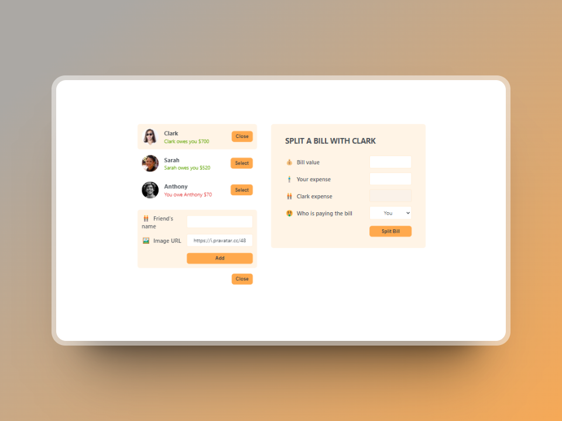

# Eat n Split

This is a React project developed using [Create React App](https://github.com/facebook/create-react-app) as part of '[The Ultimate React Course 2024](https://www.udemy.com/course/the-ultimate-react-course/)' by Jonas Schmedtmann.

## What I learned

In this project, I built a bill splitter to revise the fundamentals of React, also leaning to _make reusable components using children props_

### Screenshot

Here's a glimpse of the final project:



## Installation

To install the project, follow these steps:

1. Clone the repository:

```bash
git clone https://github.com/xyzeez/eat-n-split.git
```

2. Navigate to the project directory:

```bash
cd eat-n-split
```

3. Install dependencies:

```bash
npm install
```

4. Start the application:

```bash
npm start
```
